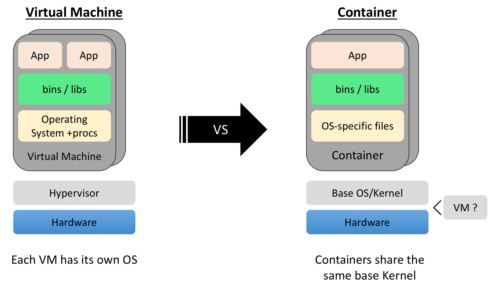
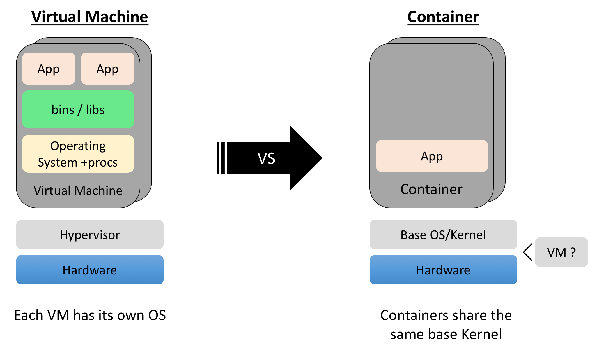

% kube101
% author(s) (mhbauer;srinib)
% date

# Kubernetes 101 {.all}

## Introduction {.all}

## Creating a Kubernetes Cluster {.all}

### IBM Cloud Setup {.all}

This is where we set up access.

## Containers

### Introduction To Containers {.doc}

Containers allows you to run securely isolated applications with quotas on system resources. Containers started out as individual features of the Linux kernel, that were commonly used together. Docker, the company, packaged up these features into a simple and convenient tool, also called docker. Nowadays we can run containers the idea on both Linux and Windows, even though they share little of the same underlying technology.

### Virtual Machines {.doc}

Prior to containers, most infrastructure ran not on the bare metal, but within single hypervisor managing multiple virtualized Operating Systems (OS). This arrangement allowed isolation of applications from one another on a higher level than that provided by the OS. These virtualized Operating Systems see what looks like their own exclusive hardware. However, this also means that each of these Operating Systems is running all of the standard system daemon processes, such as init and sshd. Additionally, each running instance has a copy of system and application libraries, taking up disk space.

### Containers {.pres}

<!-- The presentation version -->

* A group of processes run in isolation
  * Similar to VMs but managed at the process level
  * All processes MUST be able to run on the shared kernel

* Each container has its own set of "namespaces" (isolated view)
  * PID - process IDs
  * USER - user and group IDs
  * UTS - hostname and domain name
  * NS - mount points
  * NET - Network devices, stacks, ports
  * cgroups - controls limits and monitoring of resources

### Containers {.doc}

<!-- The prose version -->

Containers provide isolation similar to VMs, but provided by the Operating System and at the process level. Each container is a process or group of processes run in isolation. Typical containers explicitly run only a single process, as they do not need of the standard system services. What they do usually need can be provided by system calls to the base OS kernel. 
The isolation on linux is provided by a feature called ‘namespaces’. Each different kind of isolation is provided by a different namespace.

This is a list of some of the namespaces that are commonly used and visible to the user:
PID - process IDs
USER - user and group IDs
UTS - hostname and domain name
NS - mount points
NET - Network devices, stacks, ports
cgroups - controls limits and monitoring of resources

### VM vs Container {.doc}

---

---

---

Traditional applications are run on native machines. A single application does not typically use full resources of a single machine. We try to run multiple application on a single machine to avoid wasting resources. We could run multiple copies of the same application, but to provide isolation we used VMs to run multiple application instances on the same hardware. These VMs have full Operating System stacks which make them relatively large and inefficient due to duplication both at runtime and on disk.
	
Containers allow you to share the host OS. This reduces duplication while still providing the isolation. 

Containers allow you to drop unneeded files such as system libraries and binaries to save space, and reduce your attack surface. If sshd or libc is not installed, it cannot be exploited.

### Why Containers? {.pres}

* Fast startup time - only takes milliseconds to:
  * Create a new directory
  * Lay-down the container's filesystem
  * Setup the networks, mounts, …
  * Start the process

* Better resource utilization
  * Can fit far more containers than VMs into a host

Containers are the best thing that happened to modernise your application, build ship and run anywhere on any platform. But the essential glue to build a application lies with a strong Container Orchestrator that you chose to deploy your multi-container application. Kubernetes is one of the most popular such tools.

## Kubernetes

This has stuff about Kubernetes

## Simple Web Application

This has our web demo

### Three Tier Web Application

details about our web demo

## Further Reading and Courses

